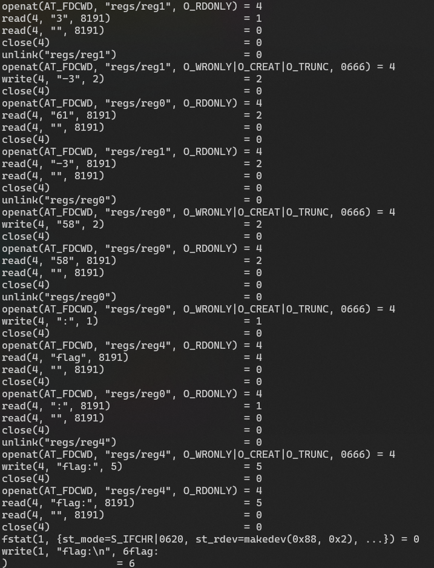
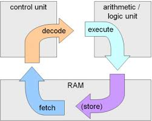
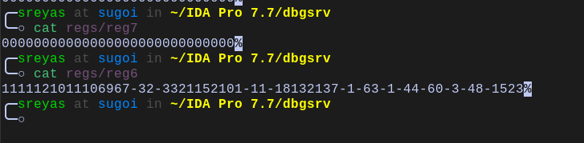
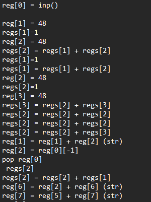

# Cpp VM revevrsing

tl;dr
- A custom vm implemented in cpp
- Uses files as registers
- Generates the flag and does a byte by byte and checks the final value

## Overview
We are given an elf binary(vm) and a binary data file(bytecode) as handouts
When we run the vm it tells us we need to give the bytecode file as an argument, lets do that. The program now asks for a flag and prints no for incorrect flag

## Intial Analysis
Lets run strace on the binary



A lot of filesystem calls are being made and it seems like this vm uses files as registers.

Now before I dive further into the analysis, lets explore how a vm or cpu works

## Understanding Virtual machines
A simple VM(virtual machine) is a program emulating a custom cpu, some popular examples are the JVM(java virtual machine) and pythonVM used to execute the java and python bytecodes respectively. Lets dive into how a simple cpu works
Cpus can be split into 4 major components
- Decoder
- ALU
- Memory(registers)
- Ram (Not part of cpu but a crucial component)

### Fetch Decode Execute cycle



The cpu is essentially doing the fetch-decode-execute-store cycle on a loop
- **fetch** - fetches the current instruction from ram
- **decodes, execute** - decodes the meaning of the opcode and executing the operation, In many simple vms and cpus the decode and execute cycles happen simultaeously
- **store** - stores the results onto ram if needed

### Types of Virtual Machines
#### Stack based
Most operations a stack based VM are carried out with the help of a stack, these types of VMs have limted or no registers at all and make extensive use of the stack.
For eg `2 + 3` could be executed as the follows
```asm
push 2
push 3
add
```
#### Register based
A register based VM typically has a lot more registers than in a stack based VM, and a favours a more x64 or arm like program style. The same `2+3` on a such a vm might look like
```asm
mov reg1, 2
move reg2, 3
add reg3, reg1, reg2
```

### Approaching a VM
When you're analysing a VM binary, the general things you gotta look out for are
- bytecode(if its not given as an external file)
- Dispatcher(Decoder in cpu terms)
- Type of VM
- Instruction structure(How many bytes each insturction is, what does each byte mean etc)
- Data storage(registers or stack or anyother datastructures)

## Further Analysis
Inside main we see the interpret function, where we find the main execution loop
The first thing we notice is that there is no explicit program counter variable, instead the std::istream class is used to keep track of where we are in the bytecode file.
Each instruction can be 1 byte(1 opcode), 2 byte(1 opcode, 1 operand), 3 byte(1 opcode, 2 operands) and 4 bytes(1 opcode, 3 operands)
Most instructions treat the register values as strings, while the instruction `0x51` treats them as integers
So far we've figured out
- bytecode(external file)
- Dispatcher(interpret function)
- Type of VM(register based)
- Instruction structure
- Data storage(as files)

Now we can analyse each opcode and write a quick disassemble with 1:1 mapping
Searching for the jump instruction in the disassembly, we only find one jump instruction near the end
```py
if reg[6] != reg[7]: jump reg[5]
```
So now we know reg[6] and reg[7] needs to be equal, hence one of these is generated from our input and the other is generated from the actual flag
After running the program multiple times and inspecting the values of the register, we can see that the value of reg[7] is all 0's while the value of reg[6] keeps on changing with the input



Now lets goto to just after input is taken



From the given code you may notice some predefined value is being generated into reg[1] and the last value of our input is popped into reg[2]
Then value of reg[1] is subtracted(regs[2] = -regs[2] + regs[1]) from reg[2] and being stored in reg[2], after that we append it to reg[6], and reg[5]\(value 0) is being appened to reg[7]
Since we want reg[6] == reg[7] we need reg[6] to be all 0's for that each reg[2] must be 0, in this particular pattern final value of reg[2] = -reg[2]\(input.pop()) + reg[1]\(generated value), it will only be 0 if input.pop() == reg[1].

Did you see what just happened?

This program is generating each character of the flag in reverse order and doing a byte by byte check

## Solution
Now that we figured it out, how do we solve it? Well there are a bunch of approaches, we can give a crafted input and subtract that value from the final value of regs[6], or we can debug through the program and extract the value of regs[1] at each stage and put it as the flag, the way I tried was to put a breakpoint at opcode 0x54 and read the value of regs[1] when the breakpoint is hit, this gives us the flag as `openECSC{supereasyvmc4e87c4d}` 
